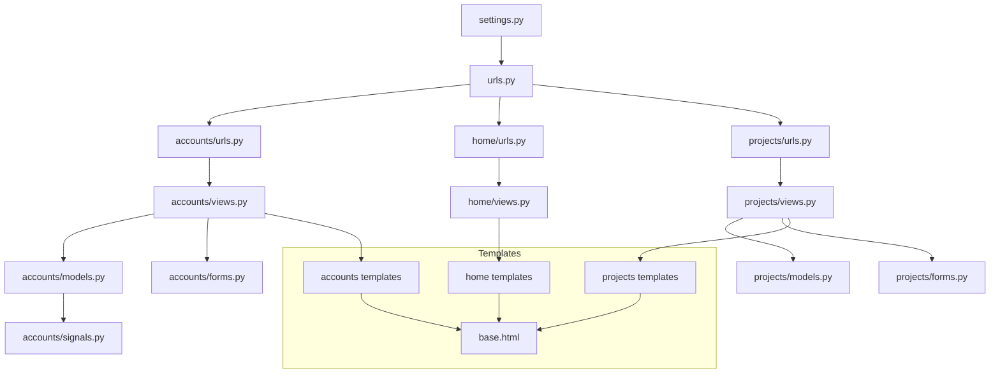

# Holberton Hub Codebase Structure Diagram

## Project Overview

This document provides a visual representation of the Holberton Hub codebase structure, showing the relationships between different components and files.

## Directory Structure

```
holberton_hub/
│
├── __init__.py                     # Package initialization
├── asgi.py                         # ASGI configuration
├── settings.py                     # Project settings
├── urls.py                         # Main URL configuration
├── wsgi.py                         # WSGI configuration
│
├── accounts/                       # User account management
│   ├── __init__.py
│   ├── admin.py                    # Admin configuration
│   ├── apps.py                     # App configuration
│   ├── forms.py                    # Form definitions
│   ├── migrations/                 # Database migrations
│   ├── models.py                   # User models
│   ├── signals.py                  # Authentication signals
│   ├── tests.py                    # Test cases
│   ├── urls.py                     # Account-related URLs
│   └── views.py                    # Account-related views
│
├── home/                           # Home page functionality
│   ├── __init__.py
│   ├── admin.py
│   ├── apps.py
│   ├── migrations/
│   ├── models.py
│   ├── tests.py
│   ├── urls.py                     # Home page URLs
│   └── views.py                    # Home page views
│
├── projects/                       # Project management
│   ├── __init__.py
│   ├── admin.py
│   ├── apps.py
│   ├── forms.py                    # Project forms
│   ├── migrations/
│   ├── models.py                   # Project models
│   ├── tests.py
│   ├── urls.py                     # Project URLs
│   └── views.py                    # Project views
│
├── static/                         # Static files
│   ├── css/
│   ├── img/
│   └── js/
│
└── templates/                      # HTML templates
    ├── accounts/
    ├── base.html                   # Base template
    ├── home/
    └── projects/
```

## Component Relationships



## Data Flow

1. **User Authentication Flow**:
   - URL requests → accounts/urls.py → accounts/views.py
   - accounts/views.py interacts with accounts/models.py and accounts/forms.py
   - Renders templates from templates/accounts/

2. **Project Management Flow**:
   - URL requests → projects/urls.py → projects/views.py
   - projects/views.py interacts with projects/models.py and projects/forms.py
   - Renders templates from templates/projects/

3. **Home Page Flow**:
   - URL requests → home/urls.py → home/views.py
   - Renders templates from templates/home/

## Key Components

### Models
- **User Models** (accounts/models.py): Extends Django's user model for custom functionality
- **Project Models** (projects/models.py): Defines project structure and relationships

### Views
- **Account Views**: Handle user registration, login, profile management
- **Project Views**: Handle project creation, listing, detail views, and updates
- **Home Views**: Handle landing page and dashboard displays

### Templates
All templates extend from base.html to maintain consistent layout and styling